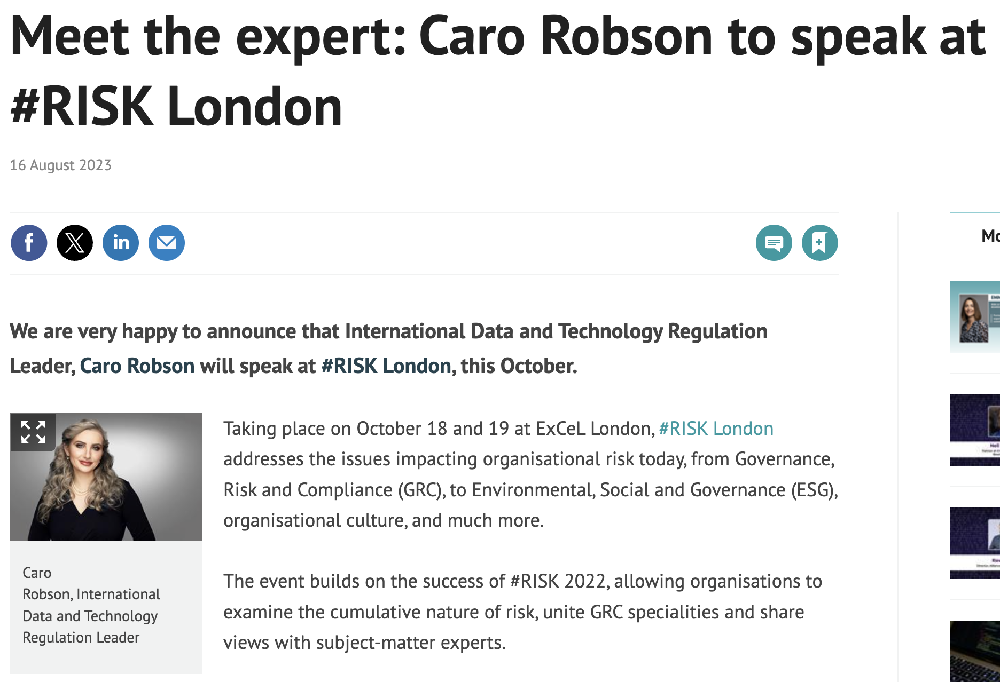
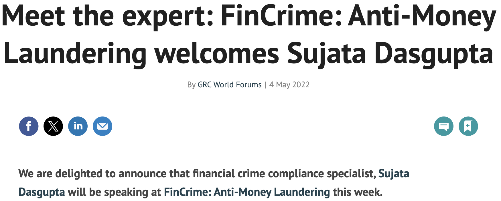
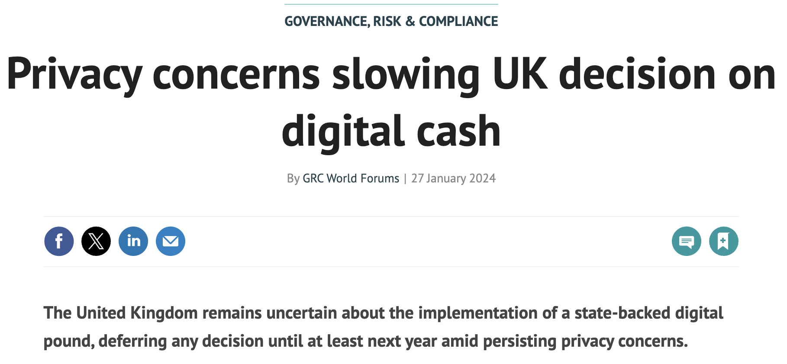
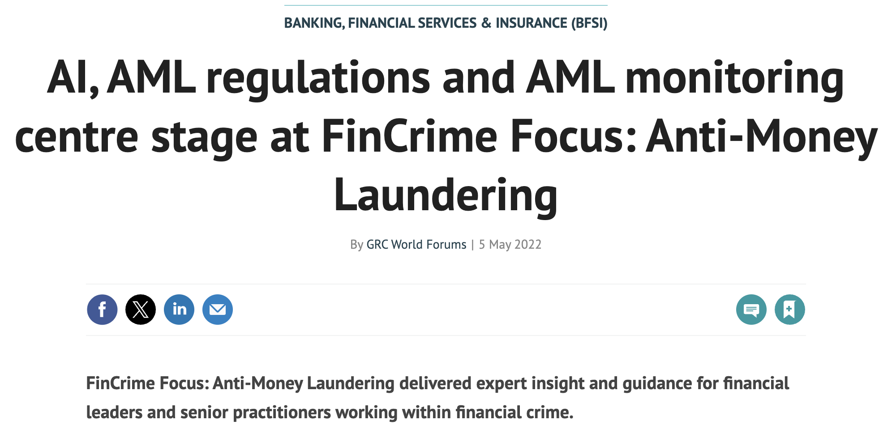
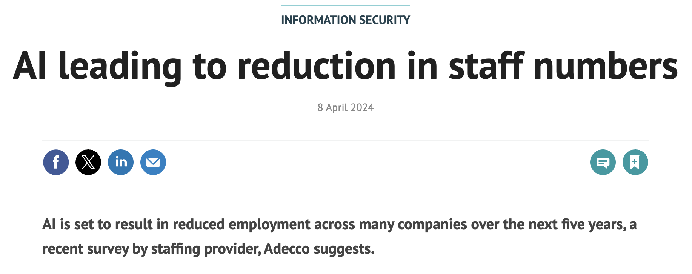

# Governance, Risk, and Compliance (GRC) Journalism
A portfolio of Governance, Risk, and Compliance journalism covering news, interviews and features written at GRC World Forums. 
Topics include: cybersecurity, privacy, financial crime and ESG.

# GRC Journalism Portfolio

A curated portfolio of governance, risk and compliance journalism by Steve White published in GRC World Forums.

Topics covered include cybersecurity, privacy, financial crime, AI governance, regulatory policy and digital risk.

## Featured Work

• **Interview: Behind The Great Hack with David Carroll**  
Interview with the data rights activist whose legal battle with Cambridge Analytica became central to the Netflix documentary *The Great Hack*. https://www.grcworldforums.com/governance-risk-and-compliance/interview-behind-the-great-hack-with-david-carroll/402.article

• **NIS2 Directive: Stronger EU Cybersecurity in the AI Era**  
Analysis of the EU’s strengthened cybersecurity framework and its implications for organisations across critical sectors.  
https://www.grcworldforums.com/governance-risk-and-compliance/nis2-directive-stronger-eu-cybersecurity-in-the-ai-era/9678.article

• **Privacy Concerns Slowing UK Decision on Digital Cash**  
Reporting on the UK debate over a potential digital pound and the privacy implications of central bank digital currency.  
https://www.grcworldforums.com/governance-risk-and-compliance/privacy-concerns-slowing-uk-decision-on-digital-cash/9278.article

## Interviews

### Interview: Behind The Great Hack with David Carroll

Publication: GRC World Forums  
Date: July 2019  
Role: Journalist / interviewer  

Interview with David Carroll, the US professor whose legal battle with Cambridge Analytica became a central narrative in the Netflix documentary *The Great Hack*. The piece explores data rights, political micro-targeting and the growing importance of privacy regulation in the age of big data.

Read the full article:  
https://www.grcworldforums.com/governance-risk-and-compliance/interview-behind-the-great-hack-with-david-carroll/402.article

### Dr Cari Miller to Speak at #RISK A.I. Digital

Publication: GRC World Forums  
Date: March 2024  
Role: Journalist / writer  

News feature announcing Dr Cari Miller as a speaker at the #RISK A.I. Digital conference, exploring the growing importance of AI governance, ethical oversight and responsible deployment of artificial intelligence within governance, risk and compliance frameworks.

Read the full article:  
https://www.grcworldforums.com/governance-risk-and-compliance/dr-cari-miller-to-speak-at-risk-ai-digital/9331.article

### Meet the Expert: Caro Robson to Speak at #RISK London

Publication: GRC World Forums  
Date: August 2023  
Role: Journalist / writer  

News feature announcing international data and technology regulation specialist Caro Robson as a speaker at the #RISK London conference, highlighting her expertise in data governance, privacy regulation and the evolving legal landscape around digital technology and information security.

Read the full article:  
https://www.grcworldforums.com/information-security/meet-the-expert-caro-robson-to-speak-at-risk-london/8797.article

### Meet the Expert: Women in GRC Speaker, Amii Barnard-Bahn

Publication: GRC World Forums  
Date: November 2021  
Role: Journalist / writer  

Profile feature introducing executive coach, strategic advisor and keynote speaker Amii Barnard-Bahn ahead of her appearance at the Women in Governance, Risk and Compliance (GRC) Forum. The article explores her career, leadership expertise and perspectives on governance, ethics and organisational culture within modern risk management.

Read the full article:  
https://www.grcworldforums.com/meet-the-expert-women-in-grc-speaker-amii-barnard-bahn/3371.article

### Meet the Expert: FinCrime: Anti-Money Laundering Welcomes Sujata Dasgupta

Publication: GRC World Forums  
Date: May 2022  
Role: Journalist / writer  

Expert profile announcing financial crime specialist Sujata Dasgupta as a contributor to the FinCrime: Anti-Money Laundering programme. The article highlights her role as Global Head of Financial Crime Compliance Advisory at Tata Consultancy Services and explores key issues facing anti-money laundering professionals, including evolving regulatory expectations and the fight against financial crime in the digital age. :contentReference[oaicite:0]{index=0}

Read the full article:  
https://www.grcworldforums.com/banking-financial-services-and-insurance-bfsi/meet-the-expert-fincrime-anti-money-laundering-welcomes-sujata-dasgupta/5279.article

### NIS2 Directive: Stronger EU Cybersecurity in the AI Era

Publication: GRC World Forums  
Date: June 2024  
Role: Journalist / writer  

News feature analysing the European Union’s NIS2 Directive and its implications for organisational cybersecurity in an era of rapidly expanding artificial intelligence capabilities. The article examines new compliance obligations, governance requirements and the broader push for stronger cyber-resilience across critical sectors operating within the EU.

Read the full article:  
https://www.grcworldforums.com/governance-risk-and-compliance/nis2-directive-stronger-eu-cybersecurity-in-the-ai-era/9678.article

### Privacy Concerns Slowing UK Decision on Digital Cash

Publication: GRC World Forums  
Date: January 2024  
Role: Journalist / writer  

News feature examining how privacy concerns are influencing the UK government’s decision on whether to introduce a “digital pound” central bank digital currency (CBDC). The article explores debates around data protection, financial surveillance and regulatory oversight as policymakers consider how to balance innovation in digital payments with safeguards for personal privacy.

Read the full article:  
https://www.grcworldforums.com/governance-risk-and-compliance/privacy-concerns-slowing-uk-decision-on-digital-cash/9278.article

### AI, AML Regulations and Monitoring Centre Stage at FinCrime Focus: Anti-Money Laundering

Publication: GRC World Forums  
Date: May 2022  
Role: Journalist / writer  

News coverage from the FinCrime Focus: Anti-Money Laundering event examining how artificial intelligence, regulatory developments and advanced monitoring systems are reshaping financial crime prevention. The article highlights discussions around building effective AML and KYC compliance programmes and the increasing role of automation and analytics in detecting illicit financial activity.

Read the full article:  
https://www.grcworldforums.com/banking-financial-services-and-insurance-bfsi/ai-aml-regulations-and-aml-monitoring-centre-stage-at-fincrime-focus-anti-money-laundering/5303.article

### AI Leading to Reduction in Staff Numbers

Publication: GRC World Forums  
Date: April 2024  
Role: Journalist / writer  

News feature examining how the growing adoption of artificial intelligence is expected to reshape the workforce within cybersecurity and information-security teams. Drawing on industry research and expert commentary, the article explores how automation, machine learning and AI-driven monitoring tools are changing organisational structures and potentially reducing the number of staff required for certain security and compliance functions.

Read the full article:  
https://www.grcworldforums.com/information-security/ai-leading-to-reduction-in-staff-numbers/9456.article

### Risk and Reward: How AI Is Driving the US Debt Collection Industry

Publication: GRC World Forums  
Date: March 2024  
Role: Journalist / writer  

News feature examining how artificial intelligence is transforming the debt-collection sector in the United States. The article explores how AI-driven analytics, automation and predictive tools are being used to improve efficiency and recovery rates while raising new questions around regulation, fairness and consumer protection.

Read the full article:  
https://www.grcworldforums.com/information-security/risk-and-reward-how-ai-is-driving-the-us-debt-collection-industry/9361.article

